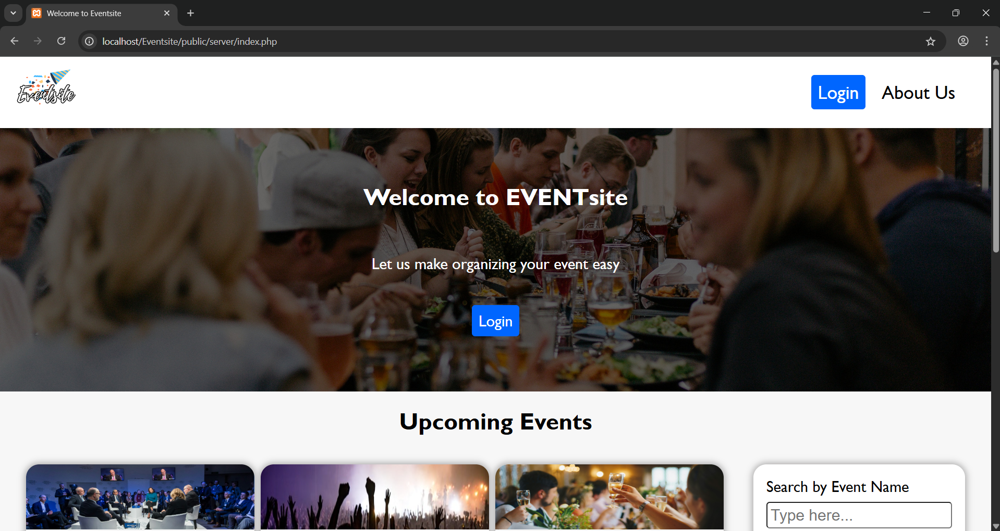
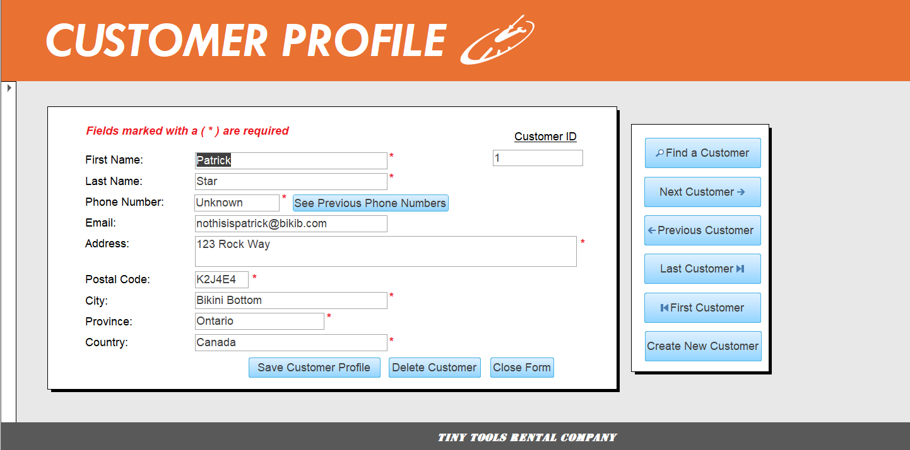

# Hello! My name is Simon Tan
I'm a computer programming student at Algonquin College, looking to become a full-stack developer in the future.

This is my personal portfolio repository, where you'll find the projects that I've worked on.

If you have an questions or wish to contact me, you can email me at simon.tan1098@gmail.com.

Thank you for visiting!

## Projects
<ol>
  <li>
    <a href="https://github.com/SimonTan98/Eventsite">Eventsite - Event Planning Website written in PHP/Javascript/CSS/HTML</a>
    
  </li>
  <li>
    <a href="https://github.com/SimonTan98/TinyToolRental">TinyToolRental - Inventory/Customer Data Mangement Software for a tool rental store written in OracleDB/MSSQLServer/MSAccess</a>
    
  </li>
  <li>
    <a href="https://github.com/SimonTan98/RecipeManager">RecipeManager - Recipe Manager application written in Java</a>
  </li>
  <li>
    <a href="https://github.com/SimonTan98/FitnessTracker">FitnessTracker - Fitness Tracker application written in Java</a>
  </li>
</ol>

